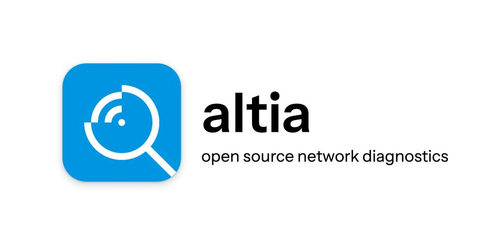
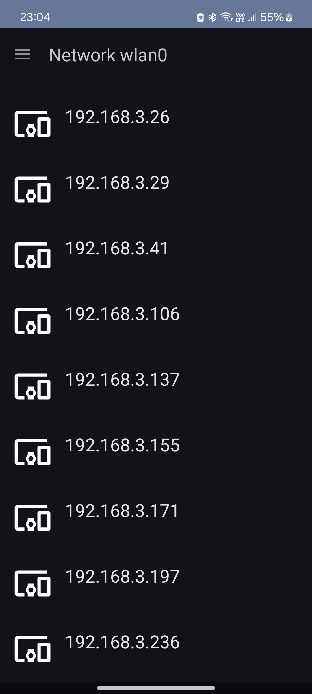
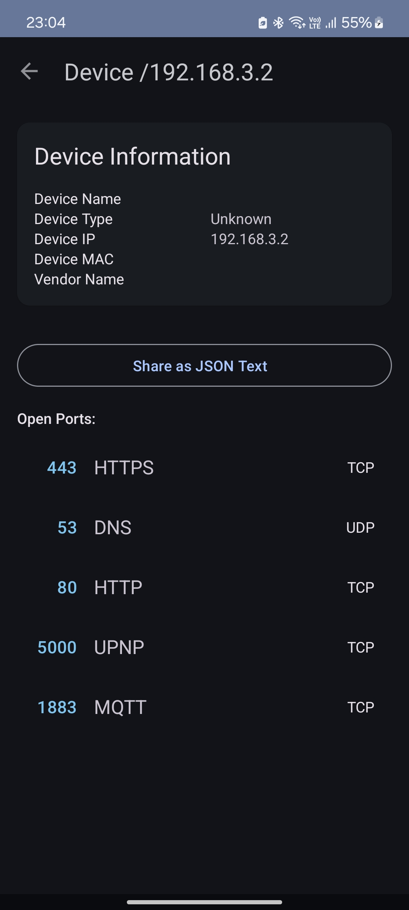
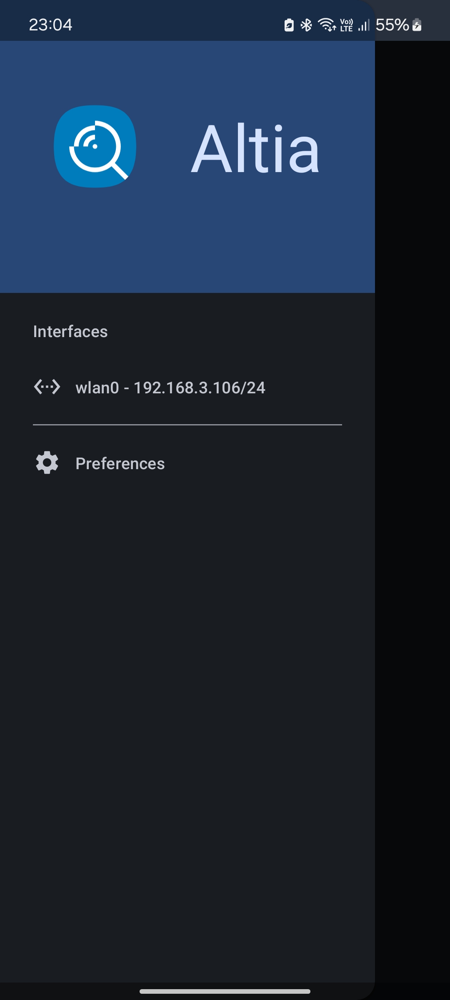

Scan local network for active devices.

Features
--------
* Ping scan
* ARP scan
* TCP and UDP scan
* Network Service Discovery (Bonjour, Avahi)
* Vendor detection









Roadmap
-------

- [ ] Scan History
    - [x] Save past scans in local db
    - [x] Use past scans for candidate selection on next scan
    - [ ] UI for scan history
- [ ] producer consumer architecture for scan
    - run `n` pings in parallel, start new ping when one ping is finished
- [ ] combine scanners into `UnifiedDeviceScanner`
- [x] Low-Level mDNS Service Discovery


Contributing
------------

### Translate the App

If you want to translate the app in your language: great!

Translatable text is located in two places:

- All strings used in the app are located under https://github.com/csicar/Ning/tree/master/app/src/main/res

- The app description for F-Droid etc. are located under https://github.com/csicar/Ning/tree/master/fastlane/metadata/android

### Development in Android Studio

The project should be easy to import in Android Studio: Just clone the repository and import it.

### Build Vendor DB
```bash
go run createMacVendorDB.go
```

## Copyright and License

Copyright (c) 2020-2021 Carsten Csiky

Copyright (c) 2024 Reinhart Previano Koentjoro

This program is free software: you can redistribute it and/or modify it under the terms of the GNU Lesser General Public License as published by the Free Software Foundation, at ther version 3 of the License (LGPL-3-Only).

This program is distributed in the hope that it will be useful, but WITHOUT ANY WARRANTY; without even the implied warranty of MERCHANTABILITY or FITNESS FOR A PARTICULAR PURPOSE. See the GNU General Public License for more details.

You should have received a copy of the GNU General Public License along with this program. If not, see <https://www.gnu.org/licenses/>. 